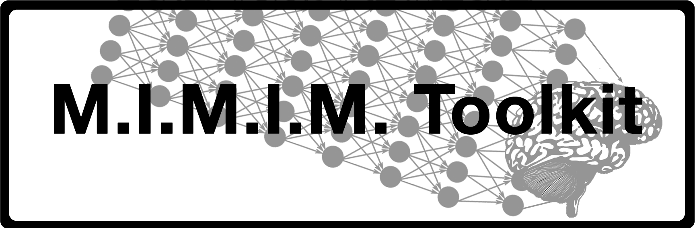
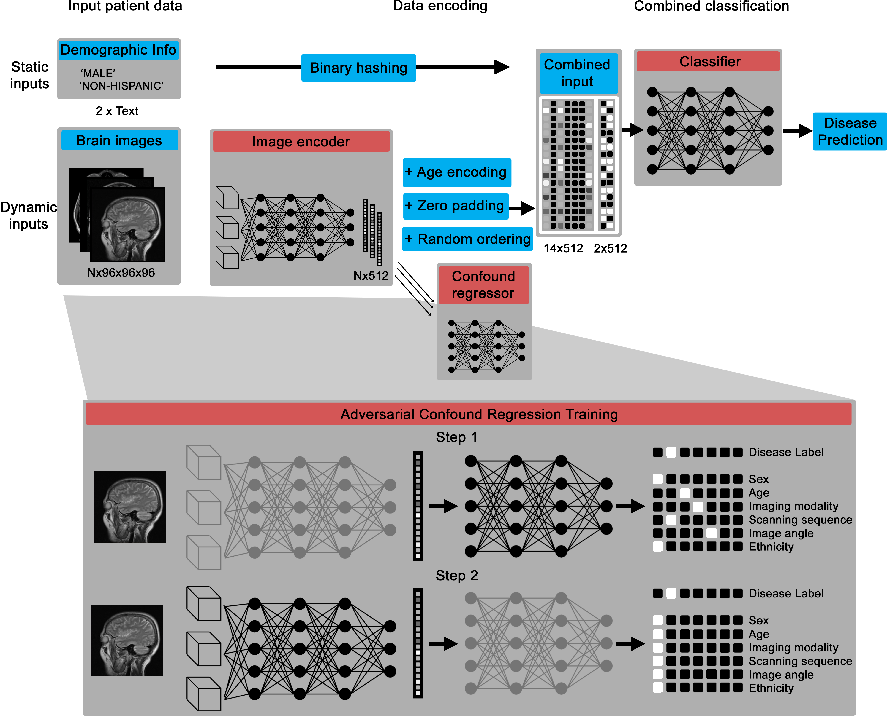
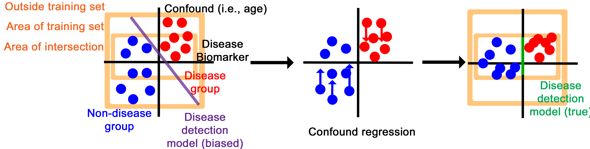

Multi-Input Medical Image Machine Learning Toolkit
==================================================

The Multi-Input Medical Image Machine Learning Toolkit (MultiMedImageML) is a library of Pytorch functions that can encode multiple 3D images (designed specifically for brain images) and offer a single- or multi-label output, such as a disease detection.

To install Multi Med Image ML, simply type into a standard UNIX terminal

    pip install multi-med-image-ml

Overview
========

The core deep learning architecture is a Pytorch model that can take in variable numbers of 3D images (between one and 14 by default), then encodes them into a numerical vector and, through an adversarial training process, creates an intermediate representation that contains information about disease biomarkers but not confounds, like patient age and scanning site.

Getting Started
===============

For best performance, download [https://github.com/rordenlab/dcm2niix](dcm2niix). This is the best program I've found for generally converting DICOMs into NIFTIs, but it's a UNIX command line program, not Python, so it needs to be installed separately.

Datasets
========

This may be used with either public benchmark datasets of brain images or internal hospital records, so long as they're represented as DICOM or NIFTI images. If they're represented as DICOM images, they are converted to NIFTI with metadata represented as a JSON file using [https://github.com/rordenlab/dcm2niix](dcm2niix). They may be further converted to NPY files, which are resized to a specific dimension, with the metadata represented in a pandas dataframe.

The MedImageLoader
